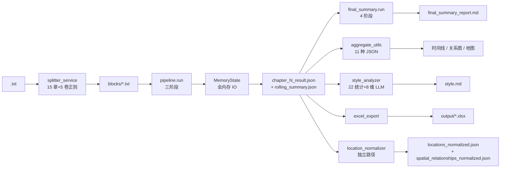
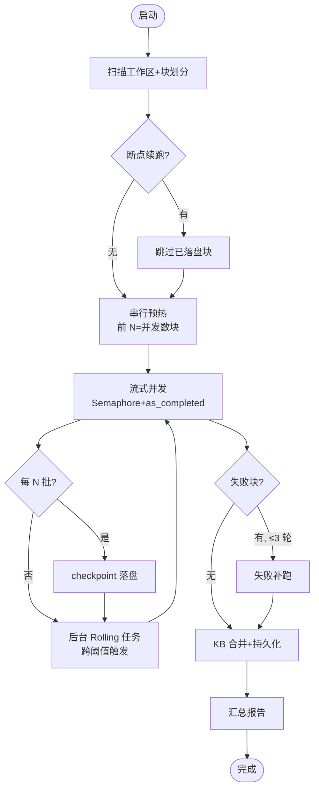
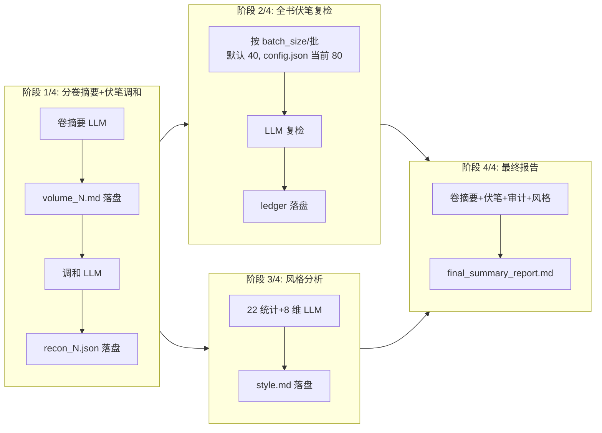

# 架构与实现

> 本文档说明 Novel Analyzer 的内部实现细节。普通使用只需要看根目录 [README](../README.md)。

## 目录结构

```
├── desktop.py                    # pywebview 桌面入口（本地副本 + NOVEL_ROOT 双目录方案）
├── backend/
│   ├── app.py                    # FastAPI 应用工厂（路由挂载 / 静态托管 / 日志轮转）
│   ├── main.py                   # 极简启动器
│   ├── progress_hub.py           # WebSocket 进度广播中枢
│   ├── api/                      # 11 组 REST 路由 + ws.py
│   ├── core/
│   │   ├── pipeline.py           # 全书分析流水线（预热 / 并发 / 补跑 / 滚动总结）
│   │   ├── analyzer.py           # 单章分析引擎（验证回调 / 重试提示）
│   │   ├── llm_client.py         # LLM 客户端（重试 / 退火 / 思考控制 / KV 统计）
│   │   ├── prompt_builder.py     # system prompt（10 规则 + 伏笔 50 类 + KV cache 布局）
│   │   ├── knowledge_base.py     # 磁盘知识库（增量合并 / 备份）
│   │   ├── memory_state.py       # 运行期内存 / 断点续跑
│   │   └── style_analyzer.py     # 风格分析（22 统计项 + 8 维语义）
│   ├── services/
│   │   ├── queue_service.py      # 队列分析编排（单例 / 自动总结 / 状态持久化）
│   │   ├── summary_service.py    # 总结编排层
│   │   ├── final_summary.py      # 总结执行器（4 阶段 + checkpoint + 伏笔总表）
│   │   ├── book_service.py       # 书目注册 / 状态
│   │   ├── splitter_service.py   # 小说切分
│   │   └── viz_service.py        # 可视化数据聚合
│   ├── config/                   # constants.py / settings.py（dataclass）/ presets.py
│   ├── models/                   # AnalysisResult / KnowledgeBase 数据模型
│   ├── utils/                    # json_utils / text_utils / aggregate_utils / excel_export / character_card_generator
│   └── tests/
├── frontend/
│   ├── src/
│   │   ├── pages/                # 12 个页面（队列 / 总结 / 设置 / 时间线 / 关系图 / 地图 / 角色卡 等）
│   │   ├── components/           # BookSelector / ProgressBar / LogConsole / ChapterDetailPanel 等
│   │   └── api/                  # client.ts（约 50 个方法）+ useProgressSocket.ts（WS 单例）
│   └── package.json              # Vue3 + Vite + Tailwind + TS
├── config.json                   # 运行配置（不提交密钥版本）
├── queue_state.json              # 队列状态持久化
├── run_dev.bat / run_desktop.bat / build_frontend.bat
└── requirements.txt
```

## 数据流全景



## 章节分析流水线（`backend/core/pipeline.py`）



1. **块划分**：按实际存在的章号切块，容错断号目录，块大小由 `analysis.block_size` 配置。
2. **串行预热**：前 N = 并发数 块顺序分析，建立初始知识库，保证后块读不到未来章节知识。
3. **流式并发**：`asyncio.Semaphore` 限流 + `asyncio.as_completed` 并发分析，每 N 批 checkpoint 落盘。
4. **失败补跑**：最多 3 轮串行重试失败块。
5. **滚动总结**：后台独立任务，跨阈值触发（短书按总章数 1/3 自适应），增量更新四层 JSON（时间轴 / 范式层 / 里程碑 / 因果链）+ 近期势头。里程碑 FIFO 淘汰但锁定首条与每范式层首条；近期势头满窗触发 LLM 归档压缩。

## LLM 客户端容错（`backend/core/llm_client.py`）

### 三重竞争（单次调用）

| 竞争方 | 描述 |
|---|---|
| API 请求 | 主路径，等待模型响应 |
| 用户停止 | 桌面端点"停止"按钮立即取消，秒级响应 |
| 硬超时 | SDK timeout + 30s 兜底，保证资源释放 |

任意一方先到即取消其他两方，实现秒级停止。

### 两级重试链

- **温度退火**：`temp = max(0, 初始 - 尝试次 × temperature_step)`，默认从 0.5 起每次降 0.25
- **指数退避**：最多 2^N 秒
- **认证失败立即终止**：不进入退避

### 思考模式双协议

`thinking_mode` 字段经 `extra_body` 注入，按厂商协议二选一：

| 协议 | 适用厂商 | payload |
|---|---|---|
| `thinking` | M2.7 / GLM / M3 | `{"thinking": {"type": "disabled"}}` |
| `enable_thinking` | DeepSeek / Qwen | `{"enable_thinking": false}` |

响应侧自动剥除 `<think>` 标签与 `reasoning_content` 字段。

### 验证回调

响应先过 `validate_response`（线程池运行），失败时在 user 消息尾部追加格式修正提示重试。

### KV cache 统计

读取厂商扩展字段统计缓存命中 token，前端可查命中率。配合下方"KV cache 布局原则"最大化命中率。

## JSON 容错解析链（`backend/utils/json_utils.py`）

9 级策略，按顺序尝试：

1. 直接解析
2. 截尾（去除末尾残缺片段）
3. 去注释
4. 漏引号定向修复（两轮，先于 lenient 解析器）
5. 全角归一
6. `json5`
7. `ast.literal_eval`
8. `json-repair`
9. 单引号值转双引号

## 伏笔系统（50 类分类，8 组）

### 分类来源

`backend/config/constants.py` 定义 50 类功能分类，分 8 组（人物 / 情节 / 冲突 / 关系 / 设定 / 主题 / 题材 / 其他），每类附 2-3 个 type 锚点，schema 版本号管理。`FORESHADOW_CATEGORY_TEXT` 是前端展示用的中文标签表。

### 双重约束

- **源头约束**：分析 prompt 内嵌分类表，要求 `type` 字段必须从中选择，禁止自创
- **被动兜底**：旧书自由式 type 经 per-book `foreshadow_type_map.json`（含 schema 校验）映射到 50 类，零 LLM 调用

### 伏笔总表流水线

收集 → 分类 → 三维过滤（重要度 ≥ 最低 / 置信度 ≥ 最低 / 类别 ∈ 保留集）→ 语义去重（关键词倒排 + SequenceMatcher ≥0.6）→ 综合排序 → 分层截断（高 500 / 中 200）

### 伏笔账本（`foreshadow_ledger.json`）

状态机：`active` / `resolved` / `dormant`。

- 休眠判定：15 批未现且跨度 ≥ 200 章
- reconciliation 逐批判定回收
- 全书复检兜底

### 时间线联动

`TimelinePage` 按 50 类 chip 多选筛选，设置页可勾选保留类别与重要度 / 置信度阈值。

## 最终总结 4 阶段（`backend/services/final_summary.py`）



| 阶段 | 内容 | 断点 |
|---|---|---|
| 1/4 分卷分析 + 伏笔调和 | 每批两次 LLM：Markdown 卷摘要 + JSON 回收判定 | 卷摘要完成即落盘；调和失败只补调和 |
| 2/4 全书伏笔复检 | 剩余 active 伏笔按 40 个 / 子批集中复检，每批携带全量卷摘要（依赖 KV cache 复用前缀） | 每批完成立即落盘账本，重启只复检剩余 active |
| 3/4 风格分析 | 统计指标 + LLM 8 维语义，注入最终报告 | 成本低，重跑无所谓 |
| 4/4 最终报告 | 卷摘要（超阈值分层压缩）+ 伏笔上下文 + 审计 + 风格 → `final_summary_report.md` | 单次调用 |

### 总结专用模型

总结页可独立选择模型（`summary_model`，复用同一 base_url / api_key，重型任务可切 M3 等）与思考模式（`summary_thinking_mode`）。空值跟随全局设置。解决思考型模型在大 prompt 上延迟过高的问题。

## 断点续跑

两级 checkpoint：

- **章节分析**：每 N 批落盘。分析中断重跑跳过已完成块
- **最终总结**：
  - 卷摘要 / 调和结果独立落盘至 `final_summary_checkpoint/`
  - 中断后只补缺的调和（已有卷摘要复用）
  - 复检阶段每批落盘账本，已回收伏笔不重复付费

## KV cache 布局原则

Prompt 结构调整时，变化频率低的块（分类表 / 世界观 / 主题）进 system 稳定前缀，让远端 KV cache 跨请求复用。检查清单：

- system 部分只放"该书基本不变"的内容（人物全集、世界观、伏笔分类表）
- user 部分放"逐章变化"的内容（章节正文、近期势头）
- 提示词版本号变化会让缓存失效，应在升级 prompt 时同步更新 `prompt_version` 字段

## 桌面端双目录方案

`pywebview` + WebView2 在中文路径 / 网络盘上有渲染限制。解决方案：

1. 启动时把工程复制到本地运行时副本（`%LOCALAPPDATA%\NovelAnalyzer\runtime\`）
2. 设 `NOVEL_ROOT` 环境变量指回原共享盘，让分析结果仍写到原位置
3. WebView2 在本地副本里加载 `dist/`，性能与中文路径同时满足

## token 统计与缓存命中率

- `analyzer.log` 记录每次 LLM 调用的 prompt / completion / total tokens
- 厂商扩展字段读取 cached_tokens（部分厂商支持），前端统计面板展示命中率
- 命中率越高，重复分析或总结重跑越便宜

## WebSocket 消息类型

`/ws/progress` 端点广播以下类型：

| 类型 | 内容 |
|---|---|
| `log` | 单行日志 |
| `progress` | 整体进度（0-100） |
| `block_done` | 单块分析完成 |
| `block_start` | 单块分析开始 |
| `state_change` | 队列 / 总结状态机切换 |
| `token_stats` | token 累计与缓存命中率快照 |
| `summary_progress` | 总结 4 阶段细分进度 |
| `discovery` | 工作区扫描发现新书 |

## 开发模式

```bash
python -m uvicorn backend.app:app --reload --port 8000   # 后端 http://localhost:8000/docs
cd frontend && npm run dev                                 # 前端 http://localhost:5173
```

CORS 已放行 `localhost:5173`。

### 新配置字段

`APIConfig` / `AnalysisConfig` dataclass 加字段即自动读写（`_filter_fields` 保证旧 `config.json` 兼容），前端 `AppConfigDto` 同步补类型。

### Prompt 调整注意

任何 prompt 结构调整都要遵守上面的"KV cache 布局原则"。
